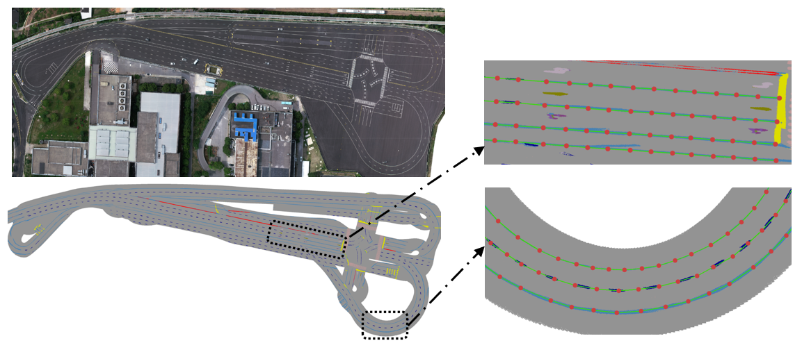
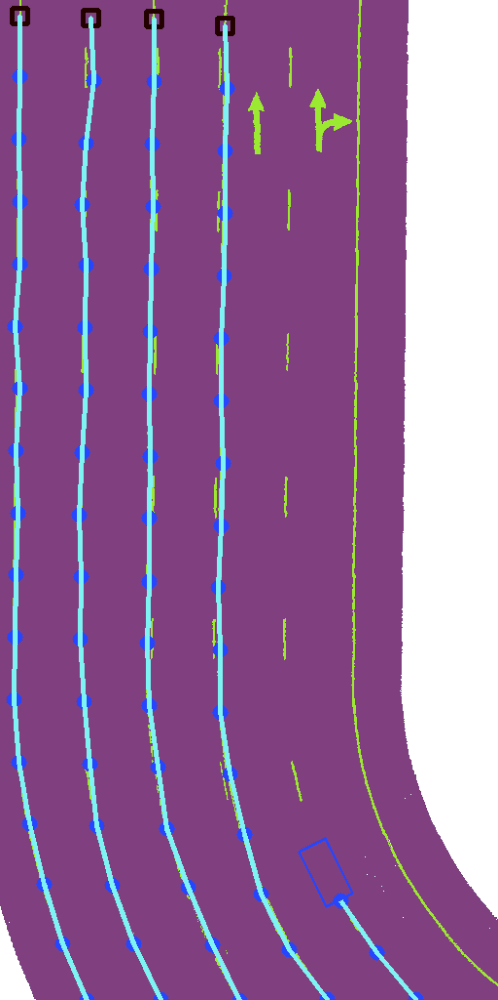
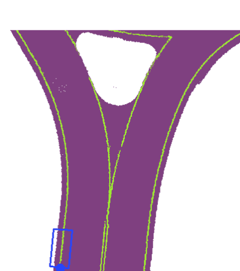
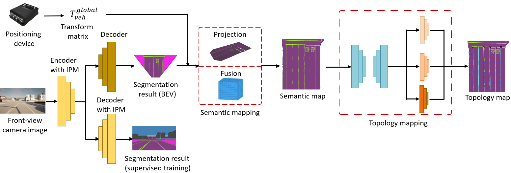
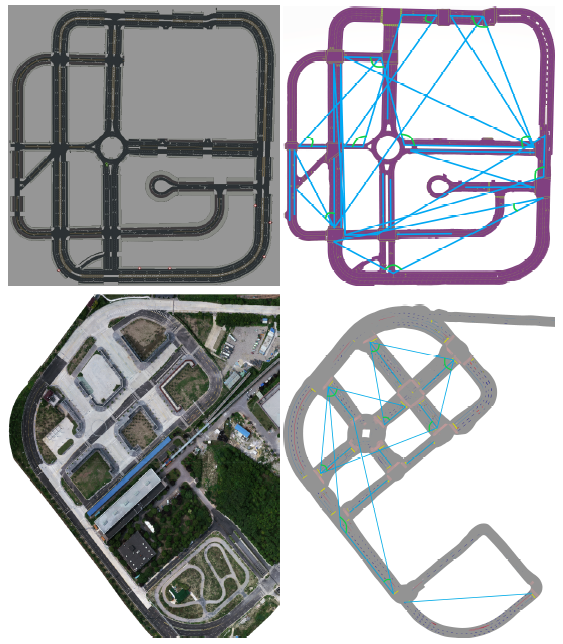
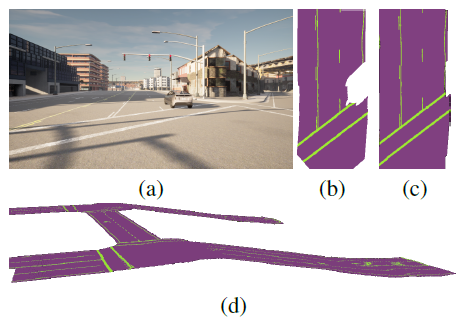
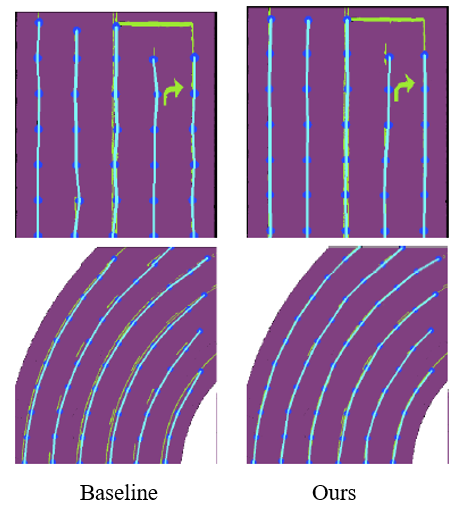
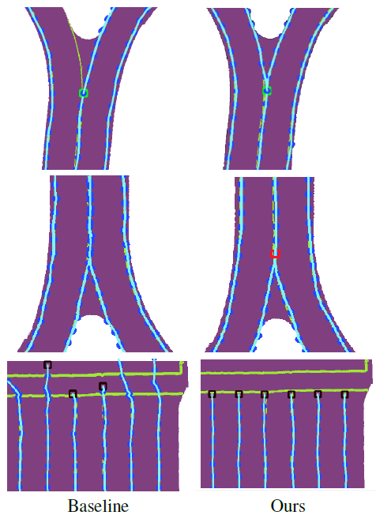

# Joint-Visual-Mapping

This repository is the PyTorch implementation for the framework of Joint-Visual-Mapping.

   

## Abstract

Comming soon......

## Framework

## Experimental results

### Mapping on Carla and test field

  
    

### Mapping with RoadSegDict

  
    

### Examples of node position prediction and node state classification

    

    

## Proposed Mapping Data Set

Comming soon...

## Citation

If you find this project useful in your research, please consider citing us.  

Comming soon...

